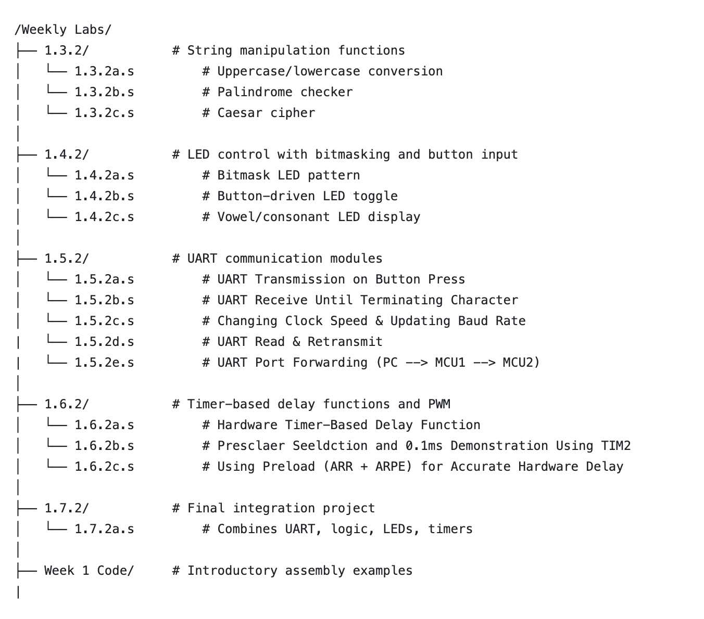

# MTRX2700 ASM Lab Project – Group G2

## Group Information

**Team Number:** S4-G2  
**Unit:** MTRX2700 – Mechatronics 2  
**Semester:** S1 2025  

### Group Members & Roles

| Name           | Role                         | Responsibilities                                                                                         |
|----------------|------------------------------|----------------------------------------------------------------------------------------------------------|
| Oscar          | Systems & Comms Lead         | String manipulation, UART communication, integration of input/output logic                               |
| Jiaze          | I/O & Control Lead           | LED bitmasking, button interfacing, timer configuration, PWM and delays                                  |
| Jason          | DevOps & Architecture Lead   | Repository structure, documentation, Git integration, assembly debugging support, **Meeting Minutes**    |

---

## Project Description

This project is a series of embedded system modules programmed in **ARM Assembly** for the **STM32F3 Discovery Board**. It was completed over Weeks 1–5 as part of the MTRX2700 ASM Lab Series.

The goal is to demonstrate modular, low-level embedded development using:
- Manual memory management and pointer logic
- LED and button I/O interaction
- Serial communication (UART)
- Hardware timers and delay functions
- Integration of all components into a working system

---

## Project Structure

The repo is structured by **lab week and exercise number**, as per the official lab manual.

## Program Overview

### Functionality:
The project processes a user-provided string and:
1. Checks if it is a **palindrome**
2. If it is, applies a **Caesar cipher**
3. Sends the result to another STM32 board via **UART**
4. The second board decodes the message and:
   - Counts the **vowels and consonants**
   - Blinks **LEDs accordingly** with a 500ms delay between each character group

### Modules:
| Module             | Description                                                                 |
|--------------------|-----------------------------------------------------------------------------|
| `string_utils`     | Handles character case conversion, palindrome check, and Caesar encryption  |
| `uart_comm`        | UART send/receive drivers with polling                                      |
| `led_control`      | Controls GPIOE output based on character counts                             |
| `timer_util`       | Implements delays and PWM control using TIM2                                |
| `integration_main` | Combines all modules in a final working system                              |

---

## Instructions for Use

### Requirements:
- STM32CubeIDE (v1.12+)
- STM32F3 Discovery Board
- Micro-USB cable
- Jumper wires (for UART connection between boards)

### Instructions:
1. Copy and paste assembly code into relevant project template in STM32CubeIDE. Changes to the "initialise.s" and "definition.s" templates have been uploaded on the repository and should also be pasted into their respective files in the project template accordingly

## Testing Plan

### Modules:
| Module             | Testing                                                                 |
|--------------------|-----------------------------------------------------------------------------|
| `string_utils`     | Check different palindromes, strings as well as decode and encode function
                       of caesar cypher                                                            |
| `uart_comm`        | UART send/receive drivers with polling                                      |
| `led_control`      | Controls GPIOE output based on character counts                             |
| `timer_util`       | Implements delays and PWM control using TIM2                                |
| `integration_main` | Combines all modules in a final working system                              |

---

